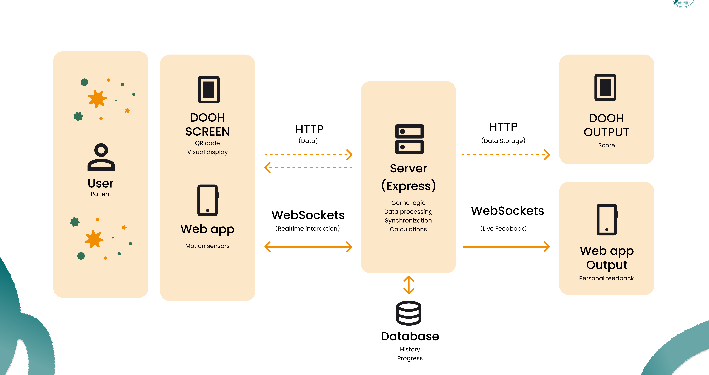
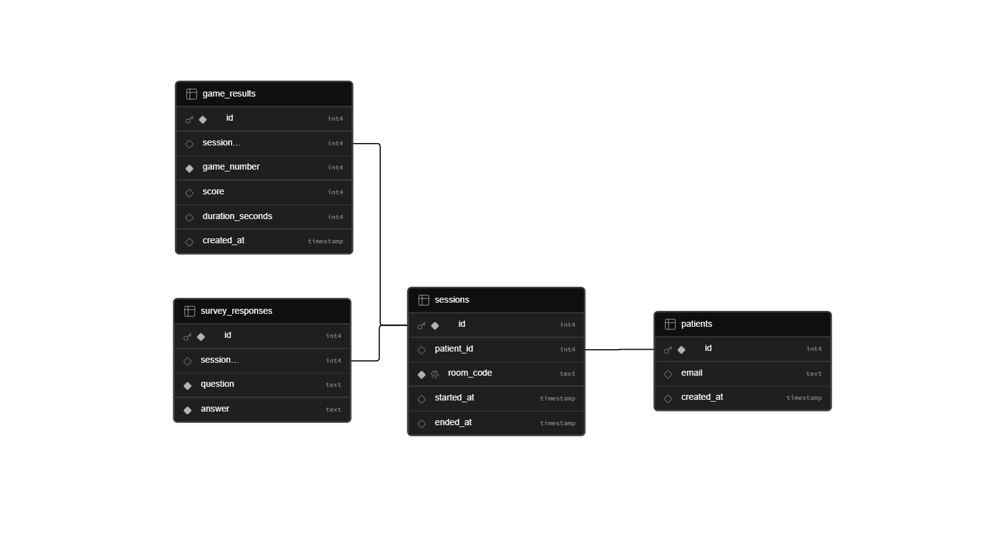

# K-Pulse: Smart Rehab System ( •̀ ω •́ )✧

K-Pulse is an interactive rehabilitation experience powered by mobile sensors and WebSockets. The user places their smartphone inside a physical therapy ball, allowing wrist and arm movements to be translated into real-time actions within a game displayed on an external screen.

Developed in collaboration with Asan Medical Center in South Korea, K-Pulse aims to support upper-limb rehabilitation by helping therapists and patients assess movement accuracy, coordination, and motor control through engaging game-based exercises.

The platform combines a mobile controller, a real-time communication server, and a screen-based game experience to create a seamless rehabilitation ecosystem that encourages participation while providing meaningful movement data.

Developed with <3 by Samuel, Isabela, and Mariana.

---

## Architecture (oﾟvﾟ)ノ



The system is composed of three main modules:

1.  **Controller**: Mobile app (React + Vite). Captures smartphone sensor data and emits events to the server. It acts as the system's primary input device.
2.  **Screen**: Large display app (React + Vite). Receives events and renders the visual experience and games. It acts as the system's visual output.
3.  **Server**: Backend (Express + Socket.io). Connects the controller and screen in real-time and persists clinical data in Supabase.

---

## Complete Flow o(〃＾▽＾〃)

`QR scan` → `Onboarding` → `Form (5 questions)` → `Instructions` → `Calibration` → `Game 1` → `Stats` → `Game 2` → `Stats` → `Email` → `Ending`

1.  The **Screen** generates a unique `room_code` and displays a QR code.
2.  The **Controller** (mobile phone) scans the QR code and joins the same room.
3.  The **Server** pairs both devices using Socket.io rooms.
4.  Every action on the mobile controller is instantly reflected on the main screen.
5.  At the end of the session, the patient's email and form responses are securely saved to **Supabase**.

---

## Database & Schema Backup (¬‿¬" )



### Tables and Relationships

| Table              | Description                                                      |
| :----------------- | :--------------------------------------------------------------- |
| `patients`         | Patient data (email).                                            |
| `sessions`         | Each game session, linked to a patient and a unique `room_code`. |
| `survey_responses` | Answers from the 5-question onboarding form.                     |
| `game_results`     | Score and duration of each game per session.                     |

### SQL Schema Backup (Supabase / PostgreSQL)

You can find the database creation SQL script in [server/schema.sql](./server/schema.sql). We also include it here for quick access and reference:

```sql
CREATE TABLE public.patients (
  id SERIAL PRIMARY KEY,
  email TEXT UNIQUE,
  created_at TIMESTAMP WITHOUT TIME ZONE DEFAULT now()
);

CREATE TABLE public.sessions (
  id SERIAL PRIMARY KEY,
  patient_id INTEGER REFERENCES public.patients(id) ON DELETE SET NULL,
  room_code TEXT NOT NULL UNIQUE,
  started_at TIMESTAMP WITHOUT TIME ZONE DEFAULT now(),
  ended_at TIMESTAMP WITHOUT TIME ZONE
);

CREATE TABLE public.survey_responses (
  id SERIAL PRIMARY KEY,
  session_id INTEGER REFERENCES public.sessions(id) ON DELETE CASCADE,
  question TEXT NOT NULL,
  answer TEXT NOT NULL
);

CREATE TABLE public.game_results (
  id SERIAL PRIMARY KEY,
  session_id INTEGER REFERENCES public.sessions(id) ON DELETE CASCADE,
  game_number INTEGER NOT NULL,
  score INTEGER,
  duration_seconds INTEGER,
  created_at TIMESTAMP WITHOUT TIME ZONE DEFAULT now()
);
```

---

## Tech Stack (づ ᴗ \_ᴗ)づ♡

| Layer             | Technology                                         |
| :---------------- | :------------------------------------------------- |
| **Frontend**      | React + TypeScript + Vite + Tailwind CSS + DaisyUI |
| **Backend**       | Node.js + Express + Socket.io                      |
| **Database**      | Supabase (PostgreSQL)                              |
| **QR Generation** | qrcode.react                                       |
| **QR Scanning**   | html5-qrcode / `getUserMedia` API                  |
| **Sensors**       | DeviceMotion API + DeviceOrientation API           |
| **Routing**       | React Router DOM                                   |

---

## Folder Structure ┐( ˘_˘)┌

```text
kpulse/
├── controller/                  # Mobile App
│   ├── src/
│   │   ├── assets/
│   │   ├── components/
│   │   │   └── SocketListener.tsx
│   │   ├── context/
│   │   │   └── Sessioncontext.tsx
│   │   ├── hooks/
│   │   ├── pages/
│   │   │   ├── onboarding/
│   │   │   ├── questionnaire/    # Questionnaire screens (1-5 + final)
│   │   │   ├── survey/           # Post-game feedback survey
│   │   │   ├── instructions/     # Tutorial screens
│   │   │   ├── games/            # Mobile controller game components
│   │   │   ├── allset/
│   │   │   └── ending/
│   │   ├── routes/
│   │   │   └── router.tsx
│   │   ├── services/
│   │   │   └── api.ts
│   │   ├── socket.ts
│   │   └── main.tsx
│   └── package.json
│
├── screen/                      # Large Screen App
│   ├── src/
│   │   ├── assets/
│   │   ├── components/
│   │   │   └── SocketListener.tsx
│   │   ├── pages/
│   │   │   ├── onboarding/
│   │   │   ├── questionnaire/
│   │   │   ├── survey/
│   │   │   ├── instructions/
│   │   │   ├── games/
│   │   │   ├── allset/
│   │   │   └── ending/
│   │   ├── routes/
│   │   │   └── router.tsx
│   │   ├── services/
│   │   │   └── api.ts
│   │   ├── socket.ts
│   │   └── main.tsx
│   └── package.json
│
└── server/                      # Backend API & WebSockets
    ├── src/
    │   ├── routes/
    │   │   ├── session.ts
    │   │   ├── patient.ts
    │   │   ├── survey.ts
    │   │   ├── results.ts
    │   │   └── report.ts
    │   ├── socket.ts
    │   ├── db.ts
    │   └── main.ts
    ├── schema.sql                # Relational database backup script
    └── package.json
```

## Running Locally

Follow these steps to install and run the project in your local environment:

### Prerequisites

- Node.js 18 or higher
- npm 9 or higher
- A Supabase account to configure the relational database

### 1. Clone the repository

```bash
git clone https://github.com/isabelacard/kpulse.git
cd kpulse
```

### 2. Configure Local Environment Variables

Create your own `.env.development` or `.env.production` files in the `controller/`, `screen/`, and `server/` directories.
_(Make sure to properly configure your SMTP credentials and Supabase database in the server module)_.

> [!WARNING]
> **Important Security Reminder**: Do NOT commit or upload any `.env` files (like `.env.development`, `.env.production`, or `.env.local`) to the remote repository. They are already included in `.gitignore` to prevent sensitive credentials (e.g., SMTP passwords, database connection strings) from being leaked.

### 3. Install Dependencies and Run Locally

You can install all dependencies and spin up the entire ecosystem (Server, Screen, and Controller) with a single command from the root directory:

```bash
# Install dependencies for root and submodules
npm install

# Start all projects in parallel (using concurrently)
npm run dev
```

This command will launch the projects on the following default local ports:

| Module         | Port   |
| :------------- | :----- |
| **Server**     | `3001` |
| **Screen**     | `5173` |
| **Controller** | `5174` |

_(Alternatively, you can navigate into `controller/`, `screen/`, and `server/` folders individually, and run `npm install` followed by `npm run dev` in separate terminals)._

---

## Deployment URLs (🚀 Deployment URLs)

- **Production Server (Backend API & WebSockets)**: [https://kpulse-1.onrender.com](https://kpulse-1.onrender.com)
- **Production Desktop Screen App**: [https://screen-kpulse.onrender.com/](https://screen-kpulse.onrender.com/)
- **Production Mobile Controller App**: [https://controller-kpulse.onrender.com/](https://controller-kpulse.onrender.com)
- **Development Server / DevTunnel Fallback**: `https://9kjbhqxg-3001.use2.devtunnels.ms/`
